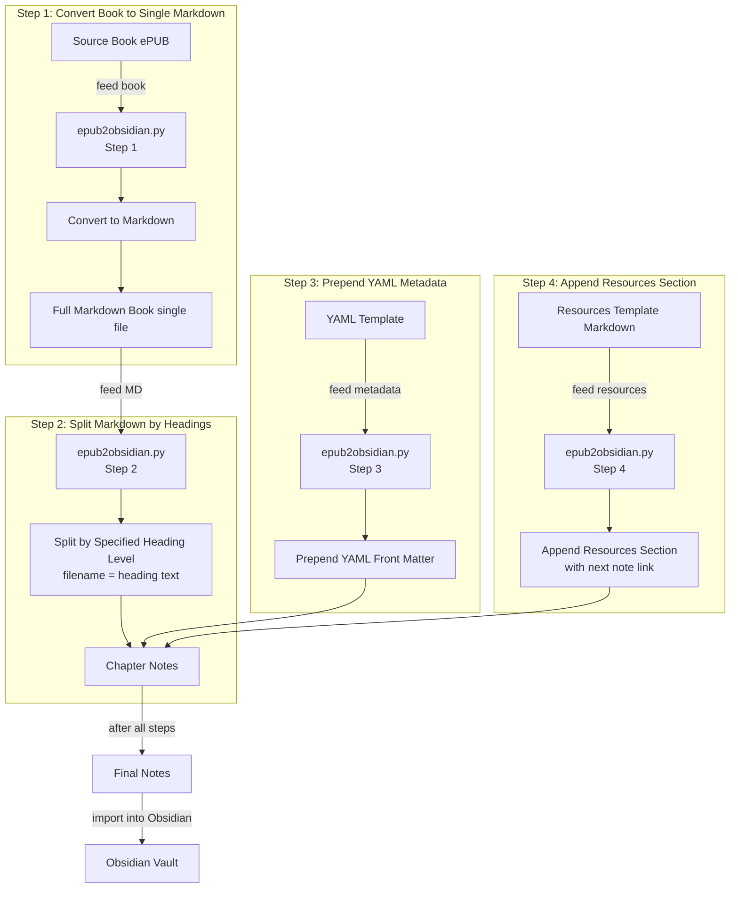

# ePUB to Obsidian Markdown Converter

> **A friendly drag-and-drop app on top of the original CLI.** This is an enhanced fork of
> [**alealeluyah/ePUB-to-Obsidian**](https://github.com/alealeluyah/ePUB-to-Obsidian) by
> [**Rafael Pimentel (808ale)**](https://github.com/808ale) — huge thanks for the original tool
> and the clean conversion pipeline this builds on. See [Credits](#credits).

A command-line tool that converts an ePUB file into a series of Obsidian-ready Markdown notes. The tool takes an input ePUB file, converts it into a single Markdown file (with media assets extracted), splits the Markdown file into individual note files based on a specified heading level, prepends YAML metadata, and appends a Resources section which includes a link to the next note. 

The notes are named according to the heading text (with illegal filename characters removed) for cleaner, human-readable file names.

## Quick start — the app (drag & drop)

No command line needed. Just drag your books in.

1. **Install [Pandoc](https://pandoc.org/installing.html)** (required engine):

   ```powershell
   winget install --id JohnMacFarlane.Pandoc -e
   ```

2. **Install the Python dependency** (one time):

   ```bash
   pip install -r requirements.txt
   ```

3. **Launch the app** — double-click `run.bat` (Windows) or run:

   ```bash
   python launch.py
   ```

   A browser tab opens automatically. **Drag one or more `.epub` files** onto the
   drop zone, choose an output folder (e.g. your Obsidian vault — use **Browse…**),
   pick the heading level to split on, and click **Convert**. Each book is written to
   its own subfolder, with images in `attachments/`. Use **Open folder** to jump
   straight to the result.

   > If Pandoc is missing, the app shows a banner with the install command.

The command-line interface below still works for scripting and power users.

## Features

- **Pandoc Conversion**: Uses Pandoc to convert ePUB (or PDF) files to Markdown, extracting images and other media.
- **Markdown Splitting**: Splits the Markdown file into individual notes based on a configurable heading level (e.g., H1 or H2).
- **Metadata Injection**: Prepends YAML front matter (from a template) to every note.
- **Resource Linking**: Appends a Resources section to each note, automatically inserting a link to the next note (using the placeholder `<NEXT_NOTE_LINK>`).
- **Customizable Filenames**: Note filenames are derived from the heading text instead of prefixed numbers or underscores.

## Flowchart

A flowchart of the project's code. 



## Repository Structure

```textfile
.
├── epub2obsidian/       # Python package (conversion logic + web server).
│   ├── converter.py     # Reusable Pandoc-based conversion pipeline.
│   └── server.py        # Flask app powering the drag & drop UI.
├── webui/               # Frontend for the app.
│   ├── index.html
│   ├── style.css
│   └── app.js
├── templates/
│   ├── metadata.yml     # YAML metadata template. (EDIT THIS)
│   └── resources.md     # Resources Markdown template with <NEXT_NOTE_LINK> placeholder. (EDIT THIS)
├── launch.py            # Starts the web app and opens the browser.
├── run.bat              # Double-click launcher (Windows).
├── requirements.txt     # Python dependency (Flask).
├── output/              # Default output folder for converted notes (git-ignored).
└── epub2obsidian.py     # Command-line interface (thin wrapper over the package).
```

## Installation

1. **Clone the Repository:**

```bash
git clone https://github.com/johnkirson/ePUB-to-Obsidian.git
cd ePUB-to-Obsidian
```

1. **Install Dependencies:**

    - Ensure you have [Pandoc](https://pandoc.org/installing.html) installed.
    - Python 3.6+ is required (only standard libraries are used).

## Usage (command line)

For scripting / power users. Run `python epub2obsidian.py --help` for the full list.

- **Positional Arguments:**
    - `epub`: Path to the input ePUB file.
    - `outfile` (optional): Intermediate Markdown path, used only with `--step-1`.
- **Optional Arguments (with defaults):**
    - `--outdir` (default: `notes`): Output directory for the final notes (media go to `outdir/attachments`).
    - `--heading-level` (default: `auto`): `auto` detects the best level; or pass `1`/`2`/`3`. If no usable headings are found, the whole book is written as a single note.
    - `--book-title` (default: filename): Title injected into the YAML front matter.
    - `--metadata` (default: `templates/metadata.yml`): YAML metadata template.
    - `--resources` (default: `templates/resources.md`): Resources Markdown template.
    - `--step-1`: Only convert the ePUB to a single Markdown file, then exit.

### Example Commands

- **Run the full pipeline (auto heading detection):**

    ```bash
    python epub2obsidian.py mybook.epub --outdir my_notes
    ```

- **Force a heading level and set a title:**

    ```bash
    python epub2obsidian.py mybook.epub --outdir my_notes --heading-level 2 --book-title "My Book"
    ```

- **Only convert to a single Markdown file (inspect before splitting):**

    ```bash
    python epub2obsidian.py mybook.epub mybook.md --step-1
    ```

## Important Notes

- **Header Level Behavior:**
    When you use a heading level (e.g., H2) that is lower than the highest-level heading in the document (e.g., H1), any content before the first H2 (including H1 text) will not be included in any note. Consider inserting a dummy heading if you want to capture introductory content.

## Disclaimer

**Legal Disclaimer:**
This tool is intended for educational and personal use only. Copying, converting, and distributing copyrighted material without explicit permission from the author or publisher is illegal. **You must have the right to modify or convert the content you process using this tool.** The authors of this repository are not responsible for any misuse of this software.

## Contributing

Contributions, issues, and feature requests are welcome! Please open an issue or submit a pull request if you have any ideas or improvements.

## Credits

This project is an enhanced fork of [**alealeluyah/ePUB-to-Obsidian**](https://github.com/alealeluyah/ePUB-to-Obsidian),
created by [**Rafael Pimentel (808ale)**](https://github.com/808ale). The original tool provided the
Pandoc-based conversion pipeline (convert → split by heading → prepend metadata → append resources)
that this fork is built on. All credit for the core idea and pipeline goes to the original author.

This fork adds:

- A drag-and-drop desktop app (local web UI) so no command line is needed.
- Automatic heading-level detection, with a guaranteed single-note fallback so **any** book converts.
- Direct output to a folder of your choice (e.g. an Obsidian vault) and an "Open folder" button.
- Pandoc auto-detection (PATH + standard install locations).

## License

Licensed under the [MIT License](LICENSE). Copyright © 2025 Rafael Pimentel (original) and
© 2026 John Kirson (app & enhancements).
